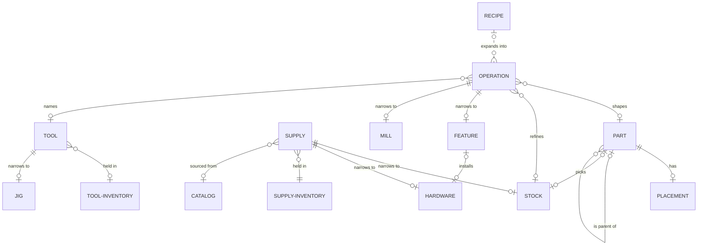
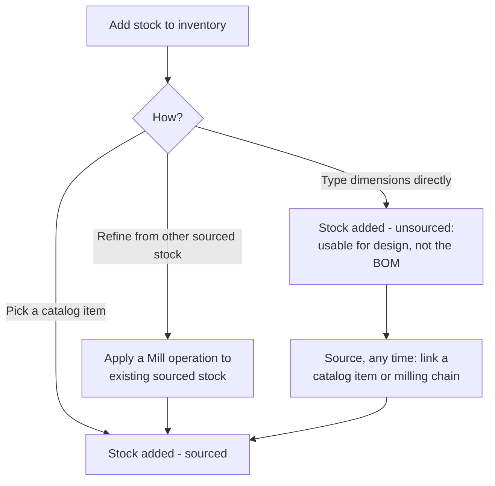
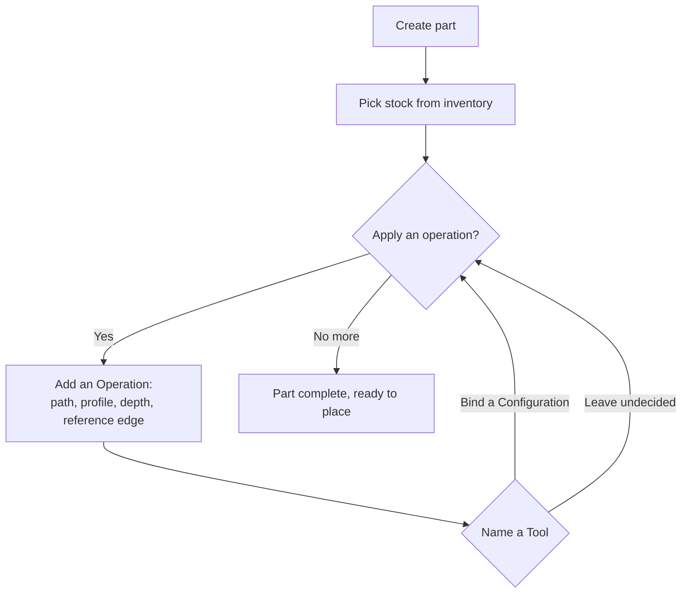
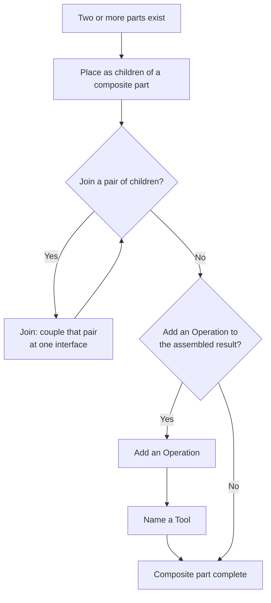
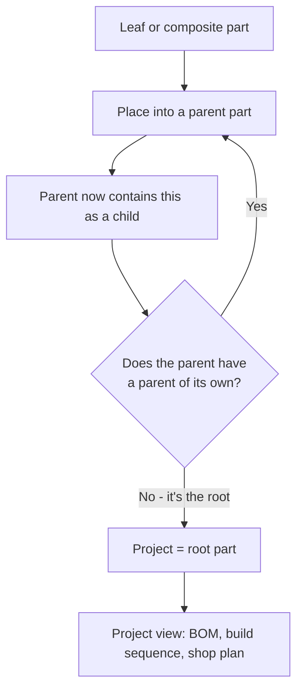
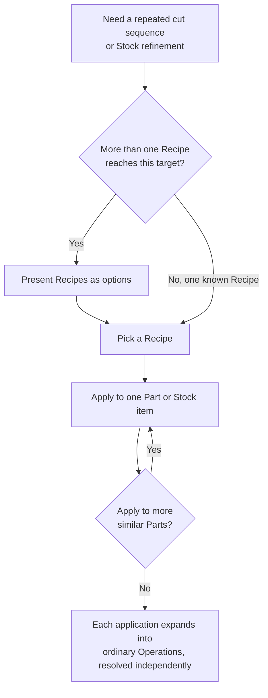
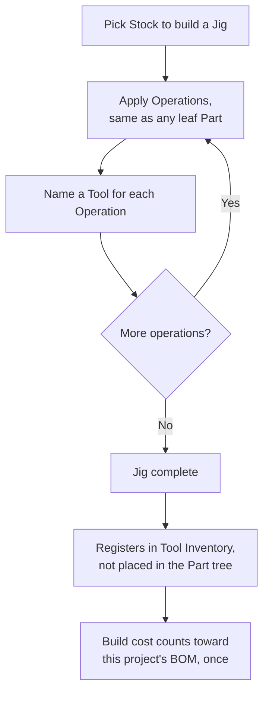

# Story Stick: High Level Design

## Overview

Story Stick is a CAD-adjacent tool for planning woodworking projects from flat stock (sheet goods and boards). It is not general CAD. Geometry is limited to swept and revolved profiles, flat-stock work and lathe work, not arbitrary free-form shapes or a general boolean modeling kernel. With Story Stick you can fully model your woodworking project in 3D space and generate cut lists, assembly instructions, bill of material lists and identify mistakes before they happen.

### Problem Statement

Woodworking is an unforgiving craft. A simple mistake could ruin a project or cost days to repair. A seasoned craftsman acts like a chess grandmaster, thinking many moves ahead of the current task to catch mistakes before making sawdust. Like all crafts, adopting this skill takes time and practice which can be frustrating for the DIYer or novice that wants to build now but can't afford the cost of mistakes. Its becoming common practice to sketch up your design in a parametric CAD program to plan out parts and assembly before making sawdust. 

However, using CAD for modeling flat stock is like lighting a cigarette with a cruise missile. Woodworking is the practice of removing and joining material to create a final assembly. Most of the features in CAD aren't needed for woodworking outside sizing and placing cuboids in 3D space. Learning to use CAD efficiently is also a steep learning curve requiring self discipline to learn and use methods and techniques that mimic real world woodworking. Additionally, running industrial grade programs like Solidworks or AutoDesk Fusion require pricey subscriptions and expensive hardware. All for features you won't use or don't need.

The ideal tool would take the power of modeling woodworking projects in CAD but apply limits and constraints that are similar to when standing at the bench. The tool would allow planning a design's assembly before cutting material: the parts, the stock, the build order. The goal is efficiency in cost, time, and waste. This is not a tool for eliminating mistakes but for reducing mistakes by uncovering design flaws early in the process. Enough simulated practice and building from scratch becomes achievable in a shorter time frame.

Concrete outputs:

- A bill of materials: net parts nested onto sourced stock, ready to buy and cut, hardware included, priced when Catalog data has it.
- A per-part shop plan: the operation sequence that produces each part.
- A step-by-step visual build sequence for reviewing your own process before the bench.
- An assembly tree showing how the build goes together.
- Build warnings: design-soundness flags, like a swept motion path that collides or a joint that fights the grain, surfaced before the bench instead of at it.

### Tenets

- Never force a workflow order. Let the user think big when designing and optimize the structure later to meet reality.
- Match the tool's language to how woodworkers think, not to CAD conventions.
- Track reality. Don't hide gaps. An unsourced or unbuildable part stays visibly distinguishable without blocking the rest of the design.
- Optimize for build efficiency, not simulation completeness.
- Simulate the craft, not its consequences.
- A shape that resists planning is information, not just a limitation. If it can only be freehand-carved, that's worth knowing before the bench, not after.

## Core Model

### Part

A Part is the model's basic unit: something with its own identity that can be shaped, sourced, and placed. Every Part is either a **leaf**, representing one physical piece, or a **composite**, representing an assembly that groups other Parts. A **Project** is always a composite Part positioned at the root, with no parent. It starts with no children and gains them as parts are placed. Being a composite, it never picks stock directly, even before those children exist.

A leaf Part's job is to represent one physical piece of material: it always starts from a single Stock pick, and its authoritative shape comes from the sequence of Operations applied to that stock.

A composite Part's role is to group other Parts together, either purely for organization or as a container for Join operations that couple specific children. Join can be invoked directly on two Parts that aren't yet siblings; a composite parent is created automatically to hold them, so nothing has to be built by hand first just to join two boards. A composite Part never picks stock itself, since its material cost comes entirely from its children's own stock, however far down the tree that stock is ultimately picked. A composite gains geometry of its own, the union of its joined children's footprint, only once two of its children are joined. Each joined child's Placement is then expressed relative to that shared geometry, which is why moving the composite moves them together. Each child can still be shaped independently at any time regardless of Join status, though what requires a prior Join is an operation that spans multiple children, applying across their combined geometry.

The Part entity is purposefully recursive: we organize Parts as nodes in an n-ary tree, with Parts nesting inside Parts without limit. Like a file system, this lets us model a drawer box inside a carcass inside a cabinet as layers within one project. Tree position is independent of physical assembly state: a composite holds its place in the structure whether or not its children are joined yet, so the tree can capture a design's intended structure ahead of any physical commitment. Each node carries a stable logical ID, so reorganizing the tree never breaks references. Outputs like the bill of materials and build sequence are all derived by walking this tree.

### Placement

Placement is what fixes a Part's position relative to its parent: a scene graph built from anchor rules (flush, centered, inset) rather than a general CAD constraint solver. Every Part's position is defined this way, all the way up the tree to the Project root.

A Placement can also carry an articulation, a rotation or a slide, with a range and a current value. This gives a door or a drawer an open-close demo and a natural reference point for where hardware gets drilled, without needing a separate hardware object library. A swept motion path colliding with nearby geometry, a door hitting a neighboring drawer, is flagged the same non-blocking way as any other gap: it rolls into Build Warnings rather than stopping the design (see Views).

Every reference in the model, Placement's own parent, Join's coupling, a Feature's attachment, points at a Part by stable identity, never by tree path. Moving a Part in the tree is purely organizational: its outgoing references still point at the same things, and nothing incoming can ever go stale.

3D placement snaps to a project-level grid with a floor of 1/32 inch, since that's roughly the finest tolerance worth caring about at the bench: anything smaller isn't a realistic woodworking measurement. Holding that floor consistently also keeps sub-1/32" error from silently accumulating across a deep tree.

### Supply

A Supply is a physical thing the project needs, tracked the same way whether it's raw material a leaf Part starts from or an item a Feature installs. Every Supply is either **sourced** or **unsourced**. A Catalog pick is sourced immediately. Something declared without a Catalog link is unsourced: usable for design, but excluded from the BOM until linked to something buyable. **Source** is the action that makes that link, tying an unsourced Supply to a Catalog entry or a making chain, and it can be called any time, not just at declaration. **Covered** is a separate flag layered on top, marking a Supply already owned, like an offcut left over from another project. The BOM only includes a Supply that's sourced and not Covered.

A Supply lives in Supply Inventory once declared. It comes in two kinds, Stock and Hardware, which differ in what they are, not in how sourcing works.

#### Stock

Stock is a single declared piece of raw material: a record of material (species, grain direction, and other such properties), length, width, and thickness, plus a starting surface state (rough, S2S, S3S, or S4S, with S4S as the common default). Material is an object, not a separate entity: nothing else in the model references it except through a Stock item. It's what a leaf Part points to when it opens, and its starting surface state seeds trueness tracking for that item going forward. Which face is show-grain versus reference-grain is a declared attribute too, used for rendering and orientation, the same as grain direction, with no check attached to it.

Stock can also be derived from other Stock, from one input or several: milling a 2×10 down into 1×3s is an ordinary refinement, and edge-gluing several boards into one wider panel blank is too. The result becomes its own Stock item, sourced only if every input was, since a part built on partly unsourced material isn't actually buyable yet. When a target size can be reached from more than one source, like ripping a 1×3 from either a 2×10 or a 2×12, that shows up as a choice between Recipes rather than a single fixed path.

A rigid Join across an interface with conflicting grain direction, the classic cause of a cracked panel or a breadboard end that can't move, is flagged the same non-blocking way as any other gap: it rolls into Build Warnings rather than stopping the design (see Views).

#### Hardware

Hardware is a discrete item with no length, width, or thickness of its own, a hinge, a slide, a pull, a latch, a fastener, a dowel. It's referenced by whichever Feature installs it, a hinge mortise, a pull's mounting holes, a domino slot, a screw's pilot hole, never picked as a leaf Part's own starting material the way Stock is.

Hardware can be bought or made: a purchased hinge sources from Catalog, a shop-turned dowel comes from Stock instead, refined the ordinary way. Either way it's still just a Supply, sourced and Covered like any other.

### Supply Inventory

Supply Inventory is the per-project pool that holds every Supply once it's declared, Stock and Hardware alike. It's what a leaf Part picks Stock from, and it's where a refinement's result lands: milling a 2×10 into 1×3s, for example, files its output back into this same pool, available for any Part, or none, to use later.

Supply Inventory is disposable and scoped to a single project. That's a deliberate contrast with Catalog and Tool Inventory, both persistent and cross-project: what material, hardware, and equipment exist in the world are facts independent of any one project, but what's on hand for this particular build is not.

Offcuts populate Supply Inventory automatically. A severed offcut above a user-set, per-project waste threshold gets filed back to inventory on its own, without an explicit refinement step, so material worth keeping doesn't need extra bookkeeping to survive being cut away.

### Catalog

Catalog is a persistent, cross-project list of purchasable items, material and hardware alike: the things you could buy, independent of any one project. Picking a Catalog entry when declaring a Supply sources it immediately, and it's one of the two things Source can link back to later, alongside a making chain, when a typed-dimension or unresolved Supply needs a buyable equivalent.

Catalog entries can carry an optional price, plus manually-updated availability notes, but nothing here is live-tracked. The tool records what the user last noted about a vendor's stock and cost, not a real-time feed.

Common Catalog entries can be saved as presets to speed up declaring a Supply, but presets never gate design. They're a shortcut: the only thing that actually requires Catalog data is the BOM, through sourcing.

### Tool

A Tool is what applies an Operation to stock or to a Part, hand or powered, and the list of available Tools is open and user-extensible. Every Tool declares itself against the same six types Operation can take (see Operation), a deliberate limit on what this app represents, not a claim about what a tool can physically do. Freeform work like carving falls outside that limit entirely: the log ends at the prepared material, and whatever happens past that point is outside the app's help.

A Tool is made up of one or more named Configurations, each enabling a subset of types with capacity limits declared per type, not as ad hoc per-tool fields. A single-job tool, like a jointer, has one implicit Configuration. A tool with attachments, like a table saw with a rip fence, a crosscut sled, and a dado stack, has several, and it only prompts for a choice when more than one Configuration could apply. This is what lets a table saw with a crosscut sled stand in for a dedicated miter saw in the shop plan. Bit or profile choice is a parameter of the Operation itself, not a separate Configuration.

A bound Tool's own setup, its fence position, blade height, and angle, can drive an Operation's geometry, or the reverse: authoring geometry directly derives those setup values automatically instead of entering them by hand. Either direction produces the same kind of log entry.

An Operation's Tool is either bound to a specific Tool and Configuration, named the same open, user-extensible way any Tool is declared, never a closed or pre-known list, or explicitly left undecided when the exact method isn't chosen yet. Both are real, visible states. Neither silently skips the question, and undecided isn't a gap that has to eventually resolve, there's often more than one way to make a cut. Whether a bound Tool happens to be owned isn't tracked here at all: ownership only matters if a project deliberately constrains itself to Tool Inventory (see Tool Inventory).

#### Jig

A jig, like a router's flush-trim template, is a specialized kind of Tool: something a Configuration can declare it requires, the same way any power tool or hand tool does. A Configuration that requires a jig can name one the same open way as any Tool, whether or not that jig has actually been built yet, the same freedom naming any other Tool has. The same jig, once it exists, can be reused across multiple Operations.

A jig is typically built rather than bought. Cutting an MDF flush-trim template consumes real Stock, and that material counts toward the BOM of whichever project built it. Once built, though, it's ordinary shop equipment like any other Tool, tracked in Tool Inventory and reusable across every future project, not just the one that made it.

Jig setup reuses the same transform machinery as Placement: a jig defines a transform between tool space and stock space, and tool-first geometry is that setup composed through it, establishing the stock's pose. That's what makes it possible to experiment with a jig's physical setup and see the resulting cut before committing to it.

### Tool Inventory

Tool Inventory is a persistent, cross-project list of Tools, each with its Configurations and capacity limits, the same persistence Catalog has for purchasable material: a Tool declared once is available to every project from then on. Its purpose is narrower than it sounds, though. Naming a Tool for an Operation never requires that Tool to be here. Tool Inventory doesn't track what you're capable of doing.

What it does instead is offer a deliberate, optional constraint. A project can choose to limit itself to only what's declared in Tool Inventory, forcing the same creative problem-solving a real shop with limited tools demands, one saw and a pile of shop-made jigs instead of an imagined full shop (see Appendix C). Outside that choice, Tool Inventory does nothing to gate design.

Common Tools can be saved as presets to speed up declaring a shop's inventory, but presets never gate design either: typing a Configuration's limits by hand works just as well.

### Operation

Operation is the abstract shape every log entry takes: applied to stock or to a Part, described by its type, path or profile, depth, and reference edge (see Type below). A concrete entry always belongs to a specific kind that gives it its meaning, but the mechanics below apply across every kind. Recording an Operation also names its Tool: bound to a specific Configuration, or explicitly left undecided (see Tool).

Every operation's position is stored relative to a named reference edge or face, never an absolute coordinate, the same anchor-rule principle Placement uses. Every operation is also hard-constrained to the stock's current dimensions, since that's a physical limit rather than a soft warning.

A Part's authoritative shape is its operation log, not a static authored shape. Its current outline and dimensions are always computed by replaying that log against the stock it started from. Severing, freeing a piece from its stock, is never its own log entry. It's simply what that replay produces when a cut happens to go all the way through.

Editing an earlier operation updates everything after it automatically. That's cheap, so it's always allowed. A replayed operation whose reference can no longer be satisfied gets flagged individually for review rather than blocking the rest of the log, and an unmet precondition, like a Planer with no true reference face or a spanning operation with no prior Join covering that span, simply means the option isn't offered in the first place.

An operation spanning multiple children, like a dado cut across two already-joined boards or a flush-trim pass truing an assembled carcass's joined corners, belongs to the composite's own log rather than to either child, and is positioned relative to the composite's own reference edge rather than either child's.

#### Type

An Operation's type names *how* it's done, one of six fixed mechanisms, the complete, stable vocabulary of what any Tool can do to stock or a Part. This is independent of Kind (Feature or Mill, below), which is about *what it's for*: the same type can serve either kind, material removal along a path can cut a bounded dado (Feature) or a whole-piece crosscut to length (Mill), while Flatten and Thickness reduction are always Mill and Edge-profile sweep is always Feature.

1. **Material removal along a path.** Parameters: path (straight or curved), cross-section profile (kerf, dado, dovetail, T-slot, round-bottom, drill circle), and depth (through or stopped). Covers straight cuts, curved cuts, channels, pockets, and bores as one type. Technique never changes which type applies, only the geometry does: a template-guided flush-trim cut and a freehand bandsaw cut to the same line are both this type. Severing is never computed. It's what the outline recalculation produces. Harvesting a second part from a cutoff is explicit: a new part's log opens by picking that offcut as stock.
2. **Flatten.** Establishes a true reference face or edge across the whole face. This is a state change, not a dimension target.
3. **Thickness reduction.** Removes material parallel to a true reference face, across the whole face, to a target thickness. This is the planer's job, and it requires a prior Flatten. There is no equivalent type for width. True width comes from type 1, referenced to an already-true edge.
4. **Edge-profile sweep.** A bit cross-section swept along an existing edge. Shares bit-profile data with type 1. Purely cosmetic, never affects the stock's declared dimensions.
5. **Revolve.** A closed 2D profile swept around an axis, producing a solid of revolution. Covers spindle and bowl turning. A hollow form's wall is drawn directly into the profile, not subtracted afterward, so no boolean step is needed.
6. **Join.** Couples two children at one interface (glue, a mechanical joint, screws, dowels). Doesn't merge geometry or logs. Not material removal.

This list is meant to be close to complete and stable.

#### Feature

A Feature is an Operation that cuts a bounded, local detail into a piece, like a dado, a mortise, a roundover, or a bore. This holds regardless of how much material comes off: an edge profile deep enough to visibly shrink an edge is still bounded to that edge, not a uniform pass across the whole face or length, so it stays a Feature. It's the woodworker-facing name for what's actually being cut, not just how the cut is made. A named Feature can also span several Operations, like the several cuts that together form one dovetail joint.

A Feature belongs to whichever Part its underlying Operations belong to. That's normally the leaf it's cut into, but for a spanning operation, like a dado cut across two already-joined boards, it's the composite's own log instead.

Join is itself a Feature, always living at the composite level: the physical union of two children, whatever the joining method used to achieve it (glue, dominoes, dowels, fasteners). Each child keeps its own stock, log, and outline. Joining never merges them. Its interface names a specific reference edge on each child, not just the pair, so a panel glued on two of its four edges is two separate Join entries, not one all-or-nothing flag. When a joint also has mechanical interlocking geometry, like dovetail pins and tails, that geometry is its own local Feature on each child. Join's Feature links to those when they exist, without needing to know their shape: it only concerns itself with the two children and the interface between them.

A Feature is a lightweight descriptor (depth, width, position) for rendering, never a boolean cut. It can affect a Part's outline, but it never retroactively changes the piece's declared stock dimensions.

A Feature can also reference the Hardware installed into it, a hinge mortise, a pull's mounting holes, a domino slot, a screw's pilot hole. This assignment is what makes Hardware BOM-eligible: without a Feature to install into, it isn't real yet. Once a Feature is declared to install Hardware, resolving it is required: sourced, or explicitly flagged as still needed. Unlike a Tool, this can't be left undecided indefinitely, Hardware ties directly to BOM accuracy, so an unresolved reference is always warned. It never blocks anything else in the design, though.

#### Mill

Mill is an Operation that sets one of a piece's overall reference dimensions or its trueness state in a single pass across the whole face, edge, or length, such as a crosscut to length, a rip to width, a Flatten, or a Thickness reduction. It's defined by that whole-piece reach, not by whether material comes off. A bounded, local cut stays a Feature even if it happens to change a measurable dimension somewhere on the piece.

Because Mill operations replay in order, the model tracks "milled" state per attribute (flat faces, true edges, true thickness, true width) independently, across any chain, whether it's shaping a Part or refining Stock. Each attribute is simply true or not: Flatten is what makes a face true, Thickness reduction (which requires a prior Flatten) is what makes the thickness true, and a rip referenced off an already-true edge is what makes the width true. Not every Mill operation sets one of these. A crosscut to length never does, since length was never part of what S2S/S3S/S4S describe, but it's still Mill vocabulary, since it dimensions the piece all the same.

Mill operations are what carry a piece through the S2S/S3S/S4S progression declared as Stock's starting surface state. Each attribute stays untrue until a Mill operation actually establishes it. Nothing is assumed true by default.

### Recipe

A Recipe is a named, reusable sequence of Operations: a template defined once and applied repeatedly, rather than re-authoring the same cuts by hand for every similar Part. Applying a Recipe expands into ordinary Operations on whatever Stock or Part it's invoked against. From that point on, those Operations are just like any other, editable independently, with no lingering link back to the Recipe that produced them.

The same Recipe can be applied in batch across several similar Parts at once, like ripping and crosscutting a whole set of face-frame stiles to the same size. Each application is independent: editing one Part's resulting Operations afterward doesn't touch any of the others.

When a target size can be reached from more than one source, like ripping a 1×3 from either a 2×10 or a 2×12, each path is its own Recipe. Having more than one is what surfaces the choice as options instead of a single fixed answer.

Every Operation a Recipe expands into still names its Tool the same as any other, bound to a Configuration, or left undecided. A Recipe doesn't bypass that; it just authors many Operations at once instead of one at a time.

Like Catalog and Tool Inventory, a Recipe is persistent and cross-project: a technique worth reusing isn't scoped to the build that first needed it.

### Entity Relationships

## Views

Each View is a computed presentation of the Core Model, never stored separately. Any View can be rooted at any node in the Part tree, not just the project root.

### Bill of Materials

The BOM's material comes from every sourced, not-Covered Stock pick that currently exists in the project: net parts nested onto sourced stock, ready to buy and cut, priced from each item's Catalog entry when one carries a price. Composite Parts contribute nothing extra, their cost is already represented by their children's own Stock picks. Rooting the BOM at a subtree includes only Stock consumed by placed Parts within it. Stock consumed by something with no tree position, like building a Jig, has nothing to check against, so it only appears in the project-level BOM. Waste-factor purchasing is a separate, optional helper, not part of the BOM itself: it bin-packs net parts onto standard sheet or board sizes to compute how many actual sheets or board feet to buy, optimizing the cut list rather than just summing net material.

The BOM also includes Hardware, referenced through the Feature that installs it, one line item per distinct Catalog entry, quantity derived from how many Features reference it. Hardware with nothing installing it isn't BOM-eligible yet.

### Shop Plan

A Part's own operation log doubles as its shop or milling step sheet: the sequence of Operations that produces it, first-class and exportable as-is. No separate computation is needed, the log already is the plan.

### Build Sequence

A step-by-step visual walkthrough of how the project assembles, for self-review before the bench. Its order comes directly from the tree: Joins replay in the order they appear in each composite's own log, walked bottom-up, so children join before the composite they belong to joins into its own parent. It's a fast working view, not a photorealistic render or in-room AR placement. Whether the sequence is actually executable, clamp access, finishing a face before it's hidden by assembly, hardware installed in the right order, is checked the same non-blocking way as any other gap: flagged, rolling into Build Warnings, never stopping the design. Finishing (sanding, stain, paint, sheen) is an appearance-only attribute on a Part or Material, used here for rendering and never simulated.

### Assembly Tree

A direct visualization of the Part tree itself, no separate computation: how the build's pieces nest into composites, all the way to the Project root.

### Build Warnings

Every design-soundness flag rolls up here project-wide: an articulation's swept path colliding with nearby geometry, a rigid Join across conflicting grain direction, a build sequence step that isn't actually executable. These are questions about whether the design as specified is physically sound, not about what's missing from the BOM. Like every other flag in the model, a Build Warning never blocks anything else in the design, it's the tenet made visible: track reality, don't hide gaps.

## UX Flow

**Adding stock to inventory.** Typed dimensions are always allowed. Only a catalog pick or a milling chain from sourced stock makes it BOM-ready. Sourcing can happen any time.

**Creating a leaf part.** It always starts from stock already in inventory. Every operation names its Tool, bound to a specific Configuration or left undecided, before moving on.

**Building a composite part.** Placing children is already a valid organizational group. Join and further milling are optional steps toward a physical assembly.

**Placing into the tree.** Leaf and composite Parts use the same recursive placement. A Project is just the Part with no parent.

**Applying a Recipe.** A named, reusable sequence of Operations, applied to one Part or Stock item at a time, or in batch across several similar ones. If more than one Recipe reaches the same target, that shows up as a choice.

**Building a Jig.** Built the same way as a leaf Part, but the result registers as a Tool instead of being placed in the tree.

## Open Questions

- Articulation clearance checking: the mechanism is settled, a flag rolling into Build Warnings, non-blocking, same as any other gap. What's still unresolved is scope: what counts as "nearby enough" to check against, and whether it's siblings only or the whole project.
- Grain-conflict threshold: the mechanism is settled, but how much conflict actually warrants a flag is craft judgment, not a clean rule. A full glued panel edge is clearly bad; a pinned tenon shoulder usually isn't. Where the line sits isn't decided.
- Buildability sequencing rules: the mechanism is settled, but the actual rule set, clamp access, finish-before-assembly, hardware install order, isn't specified. Real, non-trivial shop knowledge to encode, not attempted yet.
- Geometry kernel fallback: the sequencing is decided (hand-roll first, see Appendix B), but which specific approach, `truck`, `fornjot`, or OpenCASCADE, actually gets used if hand-rolling proves insufficient is contingent on evaluation, not decided yet.
- Batch edit propagation: a batch, several Parts gang-cut together from one setup, shares a cut across all of them, not a copy per Part. Editing that cut later needs to update every Part in the batch, not just one. Whether that's one shared log entry replayed across multiple Parts, or a per-Part entry stamped at batch time and then edited in lockstep, isn't decided.

## Appendix A: Tool Table

A starter set of examples, not an exhaustive catalog. Tools are expected to grow as users declare their own shop, hand or powered.

| Tool        | Configuration             | Operation Type                                          | Key constraints                                              |
| ----------- | ------------------------- | ------------------------------------------------------- | ------------------------------------------------------------ |
| Table saw   | Rip fence                 | Material removal (rip)                                  | Width ≤ fence travel                                         |
| Table saw   | Crosscut sled             | Material removal (crosscut, miter, bevel)               | Width ≤ sled travel                                          |
| Table saw   | Dado stack                | Material removal (channel/pocket)                       | Depth/width ≤ stack max                                      |
| Miter saw   | *(single)*                | Material removal (crosscut only, miter + bevel)         | No rip, width ≤ cut capacity                                 |
| Jointer     | *(single)*                | Flatten (face or edge)                                  | Limited by bed width/length                                  |
| Planer      | *(single)*                | Thickness reduction, referenced to a true face          | Requires prior Flatten, limited by max width/thickness       |
| Bandsaw     | *(single)*                | Material removal (curved cuts, straight rip/resaw)      | Limited by throat depth, resaw height                        |
| Track saw   | *(single)*                | Material removal (rip or crosscut, bevel)               | Not fence-bound, typical first pass on oversized sheet goods |
| Drill press | *(single)*                | Material removal (bore)                                 | Limited by quill travel, table size                          |
| Router      | Handheld                  | Material removal (channels/pockets), Edge-profile sweep | Bit-dependent, reach limited by base/edge guides             |
| Router      | Table-mounted             | Material removal (channels/pockets), Edge-profile sweep | Bit-dependent, larger stable work surface                    |
| Lathe       | Spindle (between centers) | Revolve                                                 | Length ≤ distance between centers, diameter ≤ swing          |
| Lathe       | Faceplate/chuck           | Revolve                                                 | Diameter ≤ swing over bed                                    |

## Appendix B: Implementation Notes

Decided architecture commitments with real product consequences, not part of any entity's definition and not open questions. A closed decision belongs here; an unresolved one belongs in Open Questions.

- Core pattern is Event Sourcing: the operation log is an ordered record of intent, and current state is computed by folding that log. This is the mechanism behind undo, redo, and editing an earlier operation with automatic replay.
- Not a discrete-event simulator. There is no need to model time or resource contention for v1.
- The log stays ready for a possible future DES layer: events record requests, not computed results, and timing data, if ever needed, would live on Tool/Operation definitions rather than per event.
- Schema evolves additively only, versioned per event type rather than per document, so older logs keep replaying correctly as the model grows without a whole-project migration just because one event type changed.
- Core logic is isolated from the UI/view layer, so the tool can port to another platform without rewriting the underlying model.
- Core is Rust, compiled to WASM, chosen specifically over TypeScript for the core: the compiler forces correctness in a way that catches subtle bugs (including agent-authored ones) before they ship, which matters most in exactly the logic this doc specifies (replay, BOM computation, validation). Platform is a web app, not native, since precision Pencil input turned out not to be a real requirement, removing the only reason to accept native-only distribution and a Swift/Rust FFI boundary.
- The UI shell (TypeScript, Three.js for rendering) carries no business logic. It renders mesh buffers Rust computes, captures raw interaction (drag position, raycasting hit-tests) using Three.js's own camera/scene math, and relays that upward. Rust is what decides what an interaction means for the model, a candidate drag position becoming an actual Placement is Placement's anchor-rule and grid-snapping logic, not the UI's.
- Geometry kernel scope is deliberately narrow, sweep/extrude, revolve, and planar offset for the six fixed primitives, never general boolean CSG, so the plan is to hand-roll targeted mesh generation for those cases rather than depend on a general-purpose kernel crate. Fallback ladder if that proves insufficient: `truck` or `fornjot` (pure-Rust CAD kernels, both young, evaluate before committing), then OpenCASCADE via WASM (`opencascade.js`) as a last resort. `manifold-3d`, already WASM-packaged and battle-tested, is a candidate specifically for a composite's union-of-footprints computation, independent of whichever sweep/revolve approach is used.

On limitations for the user: the anchor-rule/six-type vocabulary deliberately can't express arbitrary or highly organic geometry, that's an intentional, stated tradeoff, not a flaw. Naming a Tool for every operation, and resolving Hardware, both add a small forced step, even though "undecided" is a fully legitimate answer for a Tool. That's a genuine friction cost for someone who just wants to rough out a design fast, a reasonable price for the pedagogical goal, but worth naming honestly as a cost rather than a free win.

## Appendix C: Gamification

A constrained-build challenge mode: design against a deliberately narrow slice of what's actually available, rather than everything imaginable, and see what's buildable. Two constraints already exist as ordinary mechanics; this just reframes choosing to apply them.

- **Limited tools**: constrain a project to only what's declared in Tool Inventory, or a chosen subset of it (see Tool Inventory). TWC Design building furniture with a circular saw and a pile of shop-made jigs is the real-world version of this, not a novelty, a legitimate way people actually work.
- **Limited stock**: pre-seed a project's Supply Inventory with only specific, on-hand, Covered material, "what can I build with this one 8/4 maple board," the same mechanism as any other Covered declaration, just chosen deliberately as the whole starting point instead of a convenience.

Both already exist as ordinary mechanics; this is just choosing to use them deliberately.

A progression layer takes this somewhere more interesting: start with a small Tool Inventory and limited Supply access, earn currency by completing projects, spend it to unlock more Tools or lift Supply constraints, so bigger, more ambitious builds open up over time. It mirrors something true about the craft, a shop actually grows this way, project by project, tool by tool, which makes it a strong hook, not just a game-mechanic bolt-on.

It does need real design work the constraint modes above don't: currency, unlocking, and a definition of what counts as "completing a project" for scoring. Worth building out properly.