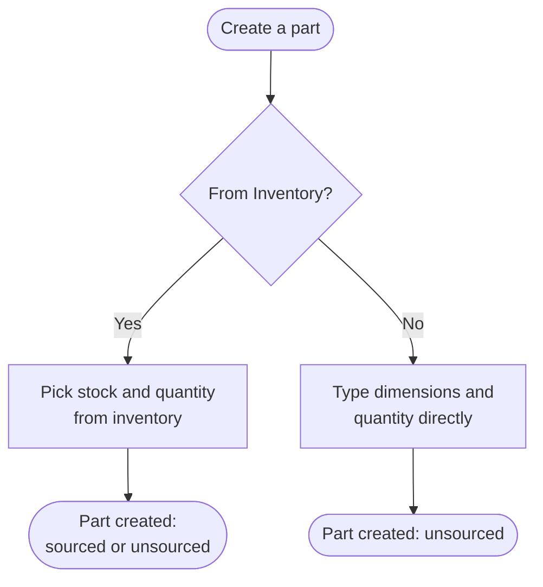
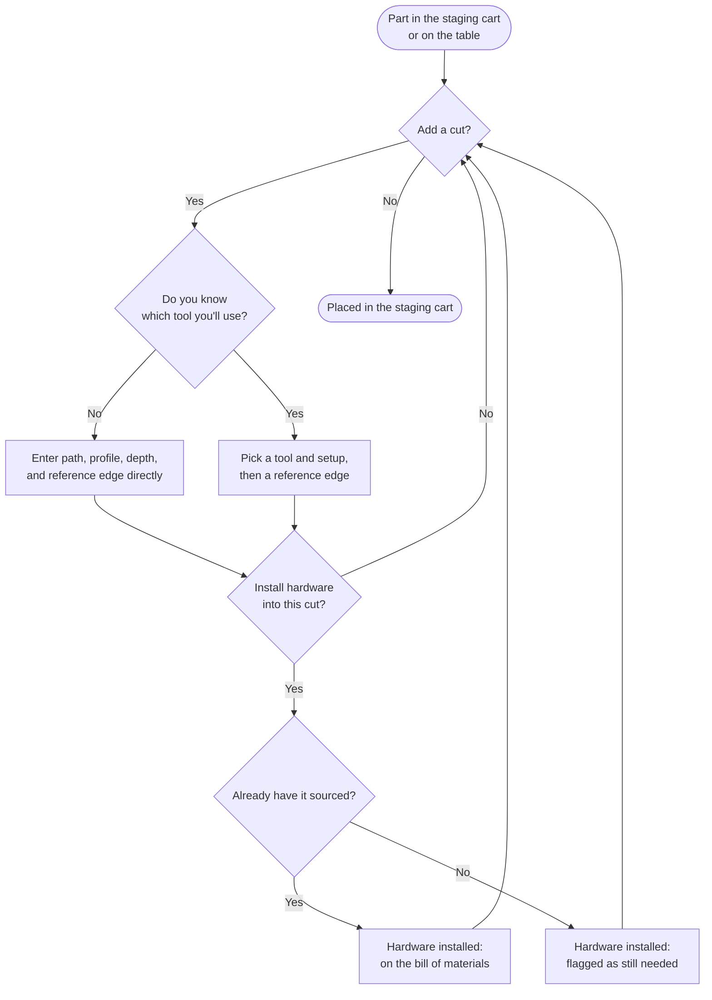
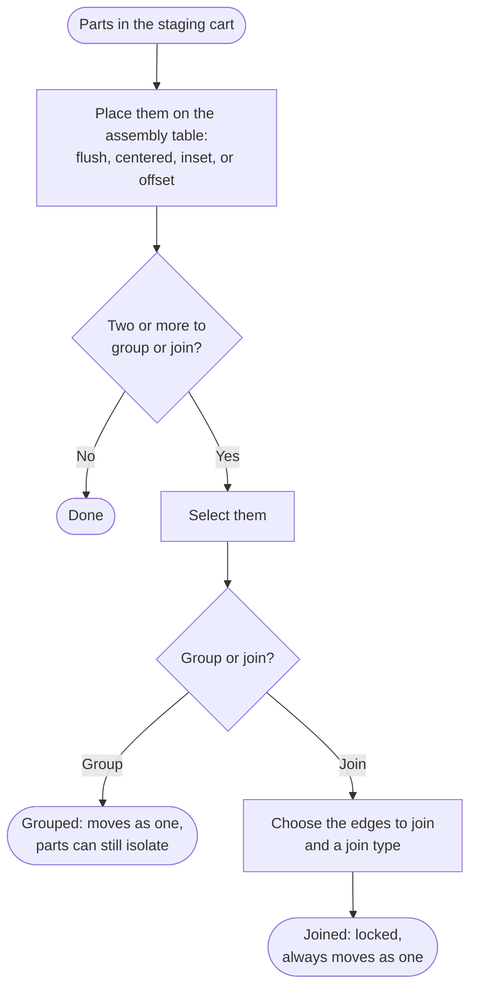
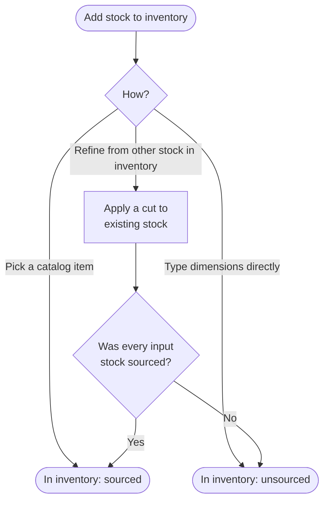
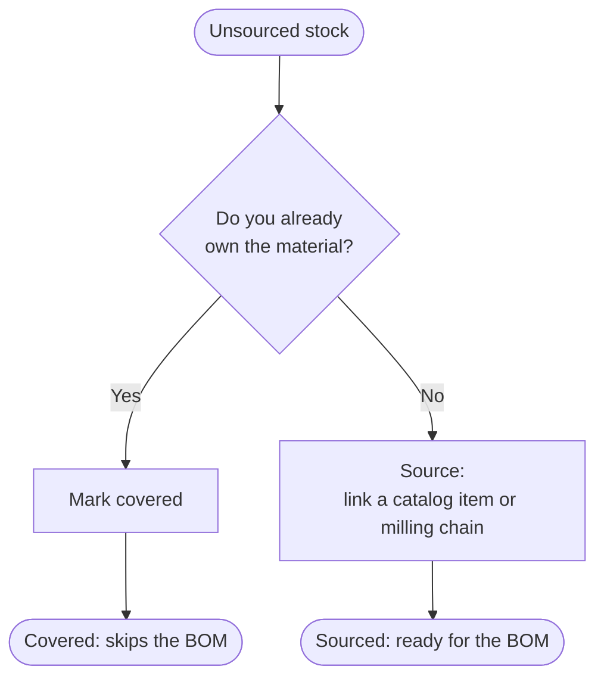
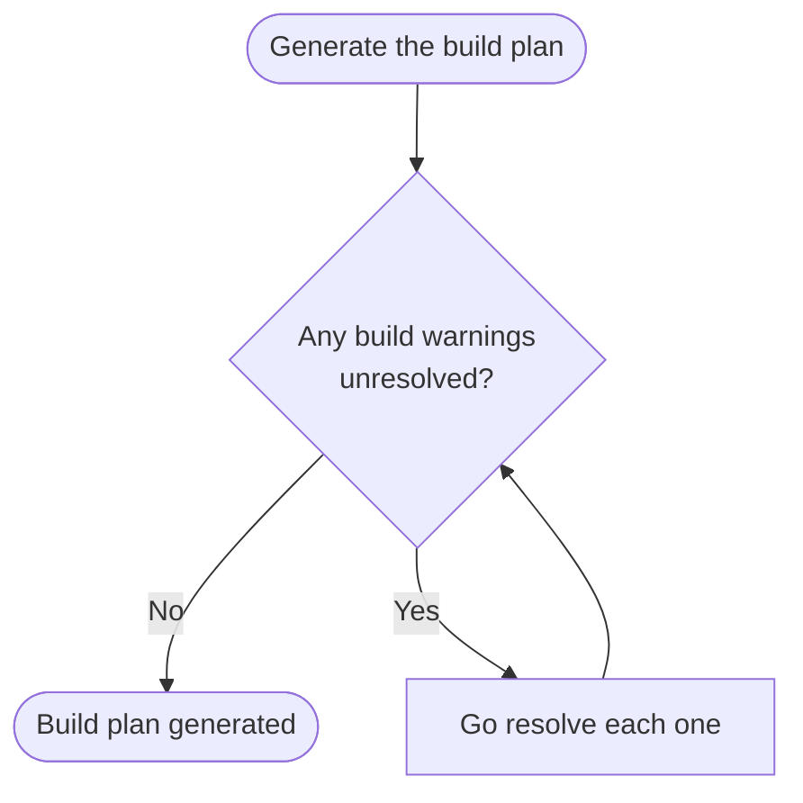

# Story Stick: Product Definition

## Overview

Story Stick is a CAD-adjacent tool for planning woodworking projects. It works with flat stock, sheet goods and boards, plus lathe work. It doesn't model arbitrary free-form shapes.

You model your project in 3D. Story Stick then generates a shop plan, and warns you about mistakes before they happen.

> This document covers the customer need, the UX, and the jobs to be done. For entities, data structures, and architecture, see [high-level-design.md](./high-level-design.md).

## Problem Statement

Woodworking punishes mistakes. A single bad cut can ruin a board or cost days of rework. A skilled woodworker plans several steps ahead to catch problems before cutting. That skill takes years to build, which is hard for a DIYer or novice who wants to start building now.

Many woodworkers now plan projects in parametric CAD before cutting. Professional CAD packages like SolidWorks or Fusion 360 are powerful tools but come with hefty subscriptions costs for features a woodworking project never touches. Woodworking only needs sizing and placement of rectangular stock in 3D space, plus a small set of cuts and joints. Pairing down a CAD application to this minimum set of features and using it efficiently takes discipline and a steep learning curve because its conventions don't map to how a woodworker thinks. 

Story Stick applies the planning power of CAD with the constraints of a woodshop. It lets you plan a design's assembly, its parts, its stock, its build order, before cutting anything. Rough out a design quickly, or constrain yourself to your actual shop's tools from the start and think it through the way you would at the bench, with the power of undo. The goal is efficiency: less wasted material, less wasted time, lower cost. It won't eliminate mistakes, but it surfaces design flaws before making sawdust.

## Jobs To Be Done

- When I plan a project, I want to know exactly what stock and hardware to buy, so I can estimate costs and ensure I have enough supply.
- When I design a part, I want to see the exact sequence of cuts that produces it, so I have a clear plan to follow at the bench.
- When I plan an assembly, I want to preview how it goes together before I glue anything, so I catch a bad fit before it's permanent.
- When I make a design decision, I want to know if it creates a physical problem, like a collision or a grain conflict, before I cut, so I don't discover it after the fact.
- When I don't yet know how I'll make a cut, I want to keep designing without picking a tool yet, so early planning doesn't stall on decisions I'm not ready to make.

## Tenets

- Never force a workflow order. Let the user think big when designing and optimize the structure later to meet reality.
- Match the tool's language to how woodworkers think, not to CAD conventions.
- Track reality. Don't hide gaps. An unsourced or unbuildable part stays visibly distinguishable without blocking the rest of the design.
- Optimize for build efficiency, not simulation completeness.
- Simulate the craft, not its consequences.
- A shape that resists planning is informative of the build, not just a limitation of the tool. If it can only be freehand-carved, that's worth knowing before the bench, not after.

## What You Get

The shop plan:

- **Bill of materials.** Net parts nested onto stock you can buy, hardware included, priced when catalog data has a price.
- **Cut list.** The exact sequence of cuts that produces each part.
- **Build sequence.** A step-by-step visual walkthrough of assembly, so you can review your process before you're at the bench.
- **Assembly tree.** A view of how the whole build fits together, from individual parts up to the finished project.

Build warnings flag problems before you cut, at the part level, an undecided tool, unsourced stock, hardware still needed, and at the project level, a motion path that collides with nearby geometry, a joint fighting the grain direction, a step that isn't actually buildable in that order. Never blocking the rest.

## User Journeys

### Vocabulary

- **Project.** The whole build you're planning. Inventory, the staging cart, the assembly table, and the build plan all belong to one project at a time.
- **Stock.** A single piece of raw material: species, size, and starting surface condition. Pick it from Inventory to start a part, or add new stock by typing dimensions, picking from Catalog, or milling it down from other stock.
- **Hardware.** A physical item installed into a part: a hinge, a screw, a pull, a dowel. Installing hardware into a part is what makes it appear on the bill of materials.
- **Inventory.** The stock and hardware currently available to your project. Raw material only.
- **Staging Cart.** Where a created part sits until placed on the assembly table.
- **Catalog.** Purchasable material and hardware, priced when known. Picking from Catalog sources that stock or hardware, not the part it ends up in, adding it to the bill of materials.
- **Sourced.** Stock or hardware linked to something buyable, a Catalog entry or a milling chain from sourced stock. Only sourced items make it into the bill of materials.
- **Covered.** Stock or hardware you already own, like an offcut from another project. Covered items skip the bill of materials since you don't need to buy them.
- **Cut.** A single cut or shaping step: what tool, what path or profile, how deep, and which edge or face it's measured from.
- **Tool.** What performs a cut: a table saw, a router, a hand plane. Each tool has one or more configurations, a rip fence, a dado stack, a crosscut sled, that determine what it can do. You can also leave a tool undecided and pick it later.
- **Jig.** A shop-made tool, like a router template. Can be a single part or a full assembly, built the normal way, except it registers as a tool instead of being placed, and its build cost counts toward this project's bill of materials once. Reusable on any future project after that.
- **Part.** A stock piece plus the cuts applied to it. Parts can group into larger assemblies which themselves become Parts that can be cut.
- **Placement.** How a part sits once it's on the assembly table: flush, centered, inset, or offset. A door or drawer's placement can also include how it opens.
- **Assembly table.** Where a part goes once placed. Only parts can be placed here, never raw stock. Only parts on the table can group or join with each other.
- **Grouped.** Parts organized together, moving as one by default, but any part can still be isolated and moved on its own.
- **Join.** Coupling exactly two parts at chosen edges, with a chosen join type: glue, fasteners, dominoes, dowels. Joined parts are physically locked, always moving as one, with no isolating one short of removing the Join, which leaves them Grouped instead.
- **Batching.** Cutting more than one identical part together, from a quantity set when creating them, one setup covering the whole group.
- **Duplicating.** Making more copies of an already-finished part, applying its cuts to other stock or parts.

### Creating a Part

A part doesn't need real material lined up to exist.

### Cutting a Part

Parts can be cut whether they are in the staging cart or placed on the assembly table. A cut applies to every part in the batch at once, the same stop-block setup a shop uses to gang-cut identical pieces. Some cuts, a hinge mortise, a pull's mounting holes, a dowel hole, exist to receive hardware. Unlike a tool, that can't be left undecided, since hardware ties directly to the bill of materials.

If a cut goes all the way through and leaves a piece worth keeping, above your project's waste threshold, it's filed back to inventory as stock on its own, no extra step needed.

Any earlier cut can be edited the same way, whatever comes after it replays automatically.

### Building an Assembly

A part is fully usable in the staging cart, cuts and all, it doesn't have to go anywhere right away. Bare parts and existing assemblies place and select the same way, since an assembly is itself a Part. Grouping is organizational and stays physically separate, any part can still be pulled out and moved on its own. Joining always couples exactly two parts at chosen edges with a chosen join type, glue, fasteners, dominoes, dowels, selecting more than two just sets up several pairwise joins at once. No isolating a joined part short of removing its Join, and lets you cut across the joined result.

A group can be dissolved back into individually placed parts, and any placed part can be pulled back to the staging cart, the same way either was entered.

### Adding Stock to Inventory

This is never a prerequisite for anything.

### Sourcing Stock

Optional, and only matters once you want this stock counted in the bill of materials.

### Resolving the Build Plan

Generating the build plan is a project-level action. Design can stay incomplete indefinitely. At the part level, a build plan is blocked by undecided tools, unsourced stock, and/or missing hardware specification. Or at the project level, a build plan can be blocked by an unspecified assembly order the system can't infer on its own. Resolving them is what turns the design into an actual build plan.

## Supported Tools & Techniques

Story Stick knows a fixed set of woodworking tools, their configurations, and what each one actually does to material. You pick "table saw, rip fence," not an abstract cut type. This is a starter set of examples, not an exhaustive list which could include both power and hand tools.

| Tool        | Configuration              | What it does                                        | Key constraints                                               |
| ----------- | --------------------------- | ---------------------------------------------------- | --------------------------------------------------------------- |
| Table saw   | Rip fence                   | Rip                                                   | Width ≤ fence travel                                             |
| Table saw   | Crosscut sled                | Crosscut, miter, bevel                                | Width ≤ sled travel                                              |
| Table saw   | Dado stack                  | Channel or pocket cut                                 | Depth/width ≤ stack max                                          |
| Miter saw   | *(single)*                   | Crosscut, miter, bevel                                | No rip, width ≤ cut capacity                                     |
| Jointer     | *(single)*                   | Flatten a face or edge                                | Limited by bed width/length                                      |
| Planer      | *(single)*                   | Reduce thickness, referenced to a true face           | Requires a flattened face first, limited by max width/thickness  |
| Bandsaw     | *(single)*                   | Curved cuts, straight rip or resaw                     | Limited by throat depth, resaw height                            |
| Track saw   | *(single)*                   | Rip or crosscut, bevel                                 | Not fence-bound, typical first pass on oversized sheet goods     |
| Drill press | *(single)*                   | Bore                                                   | Limited by quill travel, table size                              |
| Router      | Handheld                     | Channel, pocket, edge profile                          | Bit-dependent, reach limited by base/edge guides                 |
| Router      | Table-mounted                | Channel, pocket, edge profile                          | Bit-dependent, larger stable work surface                        |
| Lathe       | Spindle (between centers)    | Turn                                                   | Length ≤ distance between centers, diameter ≤ swing              |
| Lathe       | Faceplate/chuck              | Turn                                                   | Diameter ≤ swing over bed                                        |

## Open Questions

- **Articulation clearance.** A door or drawer's swept path gets flagged if it collides with nearby geometry. What counts as "nearby" isn't decided: siblings only, or the whole project.
- **Grain-conflict threshold.** A rigid joint across conflicting grain direction gets flagged. How much conflict actually warrants a flag is a craft judgment call, not a fixed rule. A full glued panel edge is clearly a problem. A pinned tenon shoulder usually isn't. Where the line sits isn't decided yet.
- **Buildability sequencing.** A build sequence step gets flagged if it isn't actually executable, missing clamp access, or finishing a face that assembly would then hide. The actual rule set for what counts as "not executable" isn't written yet.

## Gamification

A constrained-build challenge mode: design against a narrow slice of what's actually available, not everything imaginable, and see what's buildable. Two constraints already exist as ordinary features. This mode just reframes choosing to use them.

- **Limited tools.** Restrict a project to only the tools you've declared, or a chosen subset of them. This mirrors how people actually build: a circular saw and a pile of shop-made jigs, not a full shop.
- **Limited stock.** Start a project with only specific material you already have on hand. "What can I build with this one 8/4 maple board" uses the same mechanism as marking any material as already-owned, chosen deliberately as the whole starting point.

A progression layer builds on this. Start with a small tool list and limited stock. Earn currency by completing projects. Spend it to unlock more tools or lift stock limits, so bigger builds open up over time. This mirrors something true about the craft: a shop actually grows this way, project by project, tool by tool. That makes it a strong hook, not just a game mechanic bolted on.

This layer needs real design work the constraint modes above don't: currency, unlocking, and a definition of what counts as a "completed project" for scoring.

## FAQ

**Why can't I model organic or free-form shapes?**

Story Stick's cut and joint vocabulary covers flat stock and lathe work. It doesn't cover freehand carving or organic shapes. If a shape can only be made freehand, Story Stick tells you that upfront, instead of letting you design something you can't actually build from a tracked plan.

**Why do I have to name a tool for every cut, and resolve hardware before it shows up in the BOM?**

Naming a tool adds a step, though "undecided" is always a valid answer and never blocks you. Resolving hardware is required once a cut installs it, since hardware ties directly to the bill of materials, so an unresolved reference stays flagged until you address it. Both add a small amount of friction for someone who wants to rough out a design fast. That's a real cost of keeping the output accurate, not something we're hiding.
